# ChooChoo Conductor Widget - Vue Components

## Basic usage

Update `vite.config.js` plugins to treat all tags with a `choochoo` as custom elements

```diff
export default defineConfig({
-  plugins: [vue(), vueJsx()],
+  plugins: [
+    vue({
+      template: {
+        compilerOptions: {
+          isCustomElement: (tag) => tag.includes('choochoo'),
+        },
+      },
+    }),
+    vueJsx(),
+  ],
  resolve: {
    alias: {
      '@': fileURLToPath(new URL('./src', import.meta.url))
    }
  }
})
```

In your main.js file, import your component library plugin and use it:

```js
// src/main.js
import { ChoochooWidget } from '@choochoohq/widget-vue';

import { createApp } from 'vue';
import App from './App.vue';

createApp(App).use(ChoochooWidget).mount('#app');
```

In your page or component, you can now import and use your component wrappers:

```html
<template>
  <choochoo-widget 
    server-url="https://api.choochoo.cc"
    public-app-id="choochoo-app-id"
    authentication-token={{choochoo-auth-token}}
    organization_id={{user_org}}
    widget-title="ChooChoo Conductor"
    toggle-full-screen="true"
    stream-messages="true"
    widget-theme="light"
    widget-language="en"
    auto-open="true" 
  />
</template>
```

## Properties

| Property                   | Attribute                   | Description                                                                                | Type      | Default                    |
| -------------------------- | --------------------------- | ------------------------------------------------------------------------------------------ | --------- | -------------------------- |
| `authenticationToken`      | `authentication-token`      | User authentication token                                                                  | `string`  | `''`                       |
| `autoOpen`                 | `auto-open`                 | If set to True, it will open the chat, triggering the 'initialPayload' immediately if set. | `boolean` | `false`                    |
| `botIcon`                  | `bot-icon`                  | Static icon for the chatbot                                                                | `string`  | `''`                       |
| `displayTimestamp`         | `display-timestamp`         | Indicates if a message timestamp should be displayed                                       | `boolean` | `false`                    |
| `errorMessage`             | `error-message`             | Message that should be displayed if an error occurs                                        | `string`  | `'Something bad happened'` |
| `initialPayload`           | `initial-payload`           | Data that should be sent on Chat Widget initialization                                     | `string`  | `''`                       |
| `inputMessagePlaceholder`  | `input-message-placeholder` | Message placeholder for input                                                              | `string`  | `'Type your message here'` |
| `messageDelay`             | `message-delay`             | Indicates time between message is received and printed.                                    | `number`  | `600`                      |
| `messageTimestamp`         | `message-timestamp`         | Format of the message timestamp                                                            | `string`  | `''`                       |
| `publicAppId` _(required)_ | `public-app-id`             | Public App ID                                                                              | `string`  | `undefined`                |
| `senderId`                 | `sender-id`                 | ID of a user engaged with the Chat Widget                                                  | `string`  | `''`                       |
| `serverUrl` _(required)_   | `server-url`                | Url of the ChooChoo chatbot backend server (example: [https://api.choochoo.cc](https://api.choochoo.cc))                  | `string`  | `undefined`                |
| `streamMessages`           | `stream-messages`           | If set to True, bot messages will be received as stream (printing word by word).           | `boolean` | `false`                    |
| `toggleFullScreen`         | `toggle-full-screen`        | Indicates whether the chat messenger can be toggled to full screen mode.                   | `boolean` | `true`                     |
| `widgetIcon`               | `widget-icon`               | Static icon for the widget                                                                 | `string`  | `''`                       |
| `widgetTitle`              | `widget-title`              | Title of the Chat Widget                                                                   | `string`  | `'ChooChoo Conductor'`     |

## Events

| Event                           | Description                                         | Type                                  |
| ------------------------------- | --------------------------------------------------- | ------------------------------------- |
| `chatSessionStarted`            | Emitted when the Chat Widget is opened by the user  | `CustomEvent<{ sessionId: string; }>` |
| `chatWidgetClosed`              | Emitted when the Chat Widget is closed by the user  | `CustomEvent<undefined>`              |
| `chatWidgetFileStartedDownload` | Emitted when a user is starting to download a file. | `CustomEvent<undefined>`              |
| `chatWidgetHyperlinkClicked`    | Emitted when a user clicks on a hyperlink option.   | `CustomEvent<undefined>`              |
| `chatWidgetOpened`              | Emitted when the Chat Widget is opened by the user  | `CustomEvent<undefined>`              |
| `chatWidgetQuickReply`          | Emitted when the user click on quick reply          | `CustomEvent<string>`                 |
| `chatWidgetReceivedMessage`     | Emitted when the user receives a message            | `CustomEvent<unknown>`                |
| `chatWidgetSentMessage`         | Emitted when the user sends a message               | `CustomEvent<string>`                 |

## Dependencies

### Depends on

- [choochoo-session-divider](../components/session-devider)
- [chat-message](../components/message)
- [choochoo-text-message](../components/text-message)
- [choochoo-image-message](../components/image-message)
- [choochoo-video](../components/video)
- [choochoo-file-download-message](../components/file-download-message)
- [choochoo-accordion](../components/accordion)
- [choochoo-text](../components/text)
- [choochoo-quick-reply](../components/quick-reply)
- [choochoo-carousel](../components/carousel)
- [choochoo-rating](../components/rating)
- [global-error-handler](../components/error-handler)
- [choochoo-typing-indicator](../components/typing-indicator)
- choochoo-icon-close-chat
- choochoo-icon-chat
- [error-toast](../components/error-toast)
- [choochoo-chat-input](../components/choochoo-chat-input)

### Graph

```mermaid
graph TD;
  choochoo-widget --> choochoo-session-divider
  choochoo-widget --> chat-message
  choochoo-widget --> choochoo-text-message
  choochoo-widget --> choochoo-image-message
  choochoo-widget --> choochoo-video
  choochoo-widget --> choochoo-file-download-message
  choochoo-widget --> choochoo-accordion
  choochoo-widget --> choochoo-text
  choochoo-widget --> choochoo-quick-reply
  choochoo-widget --> choochoo-carousel
  choochoo-widget --> choochoo-rating
  choochoo-widget --> global-error-handler
  choochoo-widget --> choochoo-typing-indicator
  choochoo-widget --> choochoo-icon-close-chat
  choochoo-widget --> choochoo-icon-chat
  choochoo-widget --> error-toast
  choochoo-widget --> choochoo-chat-input
  choochoo-session-divider --> choochoo-text
  chat-message --> choochoo-icon-robot
  chat-message --> choochoo-text
  choochoo-text-message --> choochoo-text
  choochoo-image-message --> choochoo-image
  choochoo-image-message --> choochoo-text
  choochoo-image --> choochoo-icon-default-image-fallback
  choochoo-file-download-message --> choochoo-icon-paperclip
  choochoo-file-download-message --> choochoo-text
  choochoo-accordion --> choochoo-text
  choochoo-accordion --> choochoo-icon-chevron-down
  choochoo-quick-reply --> chat-message
  choochoo-quick-reply --> choochoo-text
  choochoo-quick-reply --> choochoo-button
  choochoo-carousel --> choochoo-image-message
  choochoo-carousel --> choochoo-icon-chevron-down
  choochoo-typing-indicator --> chat-message
  error-toast --> choochoo-icon-danger
  error-toast --> choochoo-text
  choochoo-chat-input --> choochoo-icon-paper-plane
  style choochoo-widget fill:#f9f,stroke:#333,stroke-width:4px
```



## Recommended IDE Setup

[VSCode](https://code.visualstudio.com/) + [Volar](https://marketplace.visualstudio.com/items?itemName=Vue.volar) (and disable Vetur).

## Type Support for `.vue` Imports in TS

TypeScript cannot handle type information for `.vue` imports by default, so we replace the `tsc` CLI with `vue-tsc` for type checking. In editors, we need [Volar](https://marketplace.visualstudio.com/items?itemName=Vue.volar) to make the TypeScript language service aware of `.vue` types.

## Customize configuration

See [Vite Configuration Reference](https://vite.dev/config/).

## Project Setup

```sh
pnpm install
```

### Compile and Hot-Reload for Development

```sh
pnpm dev
```

### Type-Check, Compile and Minify for Production

```sh
pnpm build
```

### Run Unit Tests with [Vitest](https://vitest.dev/)

```sh
pnpm test:unit
```

### Run End-to-End Tests with [Playwright](https://playwright.dev)

```sh
# Install browsers for the first run
npx playwright install

# When testing on CI, must build the project first
pnpm build

# Runs the end-to-end tests
pnpm test:e2e
# Runs the tests only on Chromium
pnpm test:e2e --project=chromium
# Runs the tests of a specific file
pnpm test:e2e tests/example.spec.ts
# Runs the tests in debug mode
pnpm test:e2e --debug
```

### Lint with [ESLint](https://eslint.org/)

```sh
pnpm lint
```
